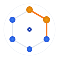

# Cyclops




[](https://godoc.org/github.com/atlassian-labs/cyclops)
[](https://github.com/cyclops-labs/workflows/actions)
[](https://goreportcard.com/report/github.com/atlassian-labs/cyclops)
[](LICENSE)

Cyclops is a Kubernetes Operator that is able to terminate and create replacement nodes for a set of nodes in a cloud provider node group, e.g. AWS's Auto Scaling Group.

It is built using the [operator-sdk](https://github.com/operator-framework/operator-sdk) and uses custom resources called `CycleNodeRequest` and `CycleNodeStatus` to manage state.
It also has a custom resource called `NodeGroup`- which is used to define groups of nodes that can be cycled.

It also contains optional controller Cyclops Observer for full automation of rotating outdated nodes, and a CLI for easy on demand scaling. This combination is great for large scale production clusters and immutable infrastructure.

## Key Features

- Cycles entire node groups safely with configurable concurrency
- Has a CLI to trigger cycling of specific node groups.
- A change observer to automatically cycle nodes when NodeGroups and DaemonSets become out of date
- Uses a Kubernetes Custom Resource Definition and Operator to enable reproducible and verifiable cycling that be be deployed safely from deployment platforms
- Halt whenever any issues are faced, preventing further damage to the cluster
- Support for full automation with an Observer controller
- Detection of out of date CloudProvider configurations
- Detection of out of date OnDelete lifecycle Kubernetes daemosnets
- CLI tool to abstract away CRD managment
- Pushing progress notifications to a messaging provider

## Planned Features & Development Roadmap

- Support for different CloudProviders. Currently only AWS is implemented.

## Documentation and Design

See [Docs](docs/README.md)

## Requirements

- [Kubernetes](https://kubernetes.io/) version 1.32+. Cyclops has been tested and deployed on 1.32+ and newer. Older versions of Kubernetes may have bugs or issues that will prevent it from functioning properly.
- [Go](https://golang.org/) version 1.23+. Newer versions of Go are highly recommended.
- Dependencies and their locked versions can be found in `go.mod` and `go.sum`.

## Building

```bash
# build Cyclops - go mod will automatically download dependencies
make build
```

### Deployment in Cluster

All the bits you need to deploy cyclops in cluster are in [docs/deployment](./docs/deployment). However you will need to set the `AWS_REGION` variable to your region.

See [Deployment](./docs/deployment/README.md) for full Deployment documentation.

```bash
# Create the CRDs
kubectl apply -f deploy/crds/
# Create the RBAC
kubectl apply -f docs/deployment/cyclops-rbac.yaml
# Create the operator deployment
kubectl apply -f docs/deployment/cyclops-operator.yaml
```

## Cycling

See [Cycling](./docs/cycling/README.md) for more documentation and examples.
Also see [Examples](./docs/cycling/examples/README.md) for more exmaple CRDs.

There are 3 different methods of trigger Cycling nodegroups with Cyclops. From most fundemental to most automated

1. Manually apply CycleNodeRequest CRDs to start cycling a particular node group
   - Most customisable, most manual effort
   - Every other method builds off this for automation
2. Deploy NodeGroup CRD templates - Use CLI
   - CLI abstraction of 1. through templating
   - Useful when many complicated nodegroups, labels, and settings
3. Deploy NodeGroup CRD templates and Observer controller
   - Fully automate triggering Cycling detecting outdated components
   - Creates CNR CRDs under the hood

See below headers for each section

### Creating a CycleNodeRequest

**This is the simplest way of getting cycling after deploying the Cyclops manager without using the automation components.**

A CycleNodeRequest or _cnr_ is a CRD which is the method of providing the Cyclops operator with requests to cycle node groups based on the configuration on of the request.

```bash
# Create a request to cycle a node group with a premade CycleNodeRequestObject.
kubectl create -f cnr.yaml
# Get the CycleNodeRequest created in the cluster, along with it's current status.
kubectl get cnr
NAME    NODE GROUP NAME                              NODE SELECTOR                                   METHOD   CONCURRENCY   STATUS      AGE
my-cnr  example.my-nodes.my-site.com                 map[matchLabels:map[role:node]]                 Drain    1             ScalingUp   4m
# Once completed, the Status will now show "Successful"
kubectl get cnr
NAME    NODE GROUP NAME                              NODE SELECTOR                                   METHOD   CONCURRENCY   STATUS        AGE
my-cnr  example.my-nodes.my-site.com                 map[matchLabels:map[role:node]]                 Drain    1             Successful    20m
```

For more details, describe the CNR to see into the operation.

```bash
# You can describe the CNR to get more information
$ kubectl describe cnr my-cnr
Name:         my-cnr
Namespace:    kube-system
API Version:  atlassian.com/v1
Kind:         CycleNodeRequest
Metadata:
  Creation Timestamp:  2019-08-29T01:54:31Z
  Generation:          9
  Resource Version:    7019110
  Self Link:           /apis/atlassian.com/v1/namespaces/kube-system/cyclenoderequests/test
  UID:                 f13c7d57-c9ff-11e9-9ea4-06545c742470
Spec:
  Cycle Settings:
    Concurrency:    1
    Method:         Drain
  Node Group Name:  example.my-nodes.my-site.com
  Selector:
    Match Labels:
      Role:      node
Status:
  Current Nodes:
    Name:         ip-10-149-72-60.us-west-2.compute.internal
    Provider Id:  aws:///us-west-2b/i-0119f6aa6b63ce0ce
  Message:
  Nodes To Terminate:
    Name:            ip-10-149-72-94.us-west-2.compute.internal
    Provider Id:     aws:///us-west-2c/i-0f4c087f7a7e9a20c
    Name:            ip-10-149-72-60.us-west-2.compute.internal
    Provider Id:     aws:///us-west-2b/i-0119f6aa6b63ce0ce
    Name:            ip-10-149-72-26.us-west-2.compute.internal
    Provider Id:     aws:///us-west-2a/i-0e50c5b04787f3c2d
  Phase:             ScalingUp
  Scale Up Started:  2019-08-29T01:58:06Z
Events:
...
```

### Using CLI

The CLI is a kubectl plugin.

`kubectl cycle -l type=default`
`kubectl cycle --all`
`kubectl cycle system --name ticket-number`

[See Docs for details and installation](./docs/automation/README.md)

### Using Observer

After deploying and configuring the Observer, nodes will cycle on their own when they become out of date.

[See Docs for details](./docs/automation/README.md)

### Pushing notifications

Cyclops can optionally push progress notifications to a messaging provider.

[See Docs for details](./docs/deployment/messaging-providers/slack/README.md)

## Contributors

Pull requests, issues and comments welcome. For pull requests:

* Add tests for new features and bug fixes
* Follow the existing style (we are using [goreturns](https://github.com/sqs/goreturns) to format and lint cyclops)
* Separate unrelated changes into multiple pull requests

See the existing issues for things to start contributing.

For bigger changes, make sure you start a discussion first by creating
an issue and explaining the intended change.

Atlassian requires contributors to sign a Contributor License Agreement,
known as a CLA. This serves as a record stating that the contributor is
entitled to contribute the code/documentation/translation to the project
and is willing to have it used in distributions and derivative works
(or is willing to transfer ownership).

Prior to accepting your contributions we ask that you please follow the appropriate
link below to digitally sign the CLA. The Corporate CLA is for those who are
contributing as a member of an organization and the individual CLA is for
those contributing as an individual.

* [CLA for corporate contributors](https://opensource.atlassian.com/corporate)
* [CLA for individuals](https://opensource.atlassian.com/individual)

## License

Copyright (c) 2019 Atlassian and others.
Apache 2.0 licensed, see [LICENSE](./LICENSE) file.
