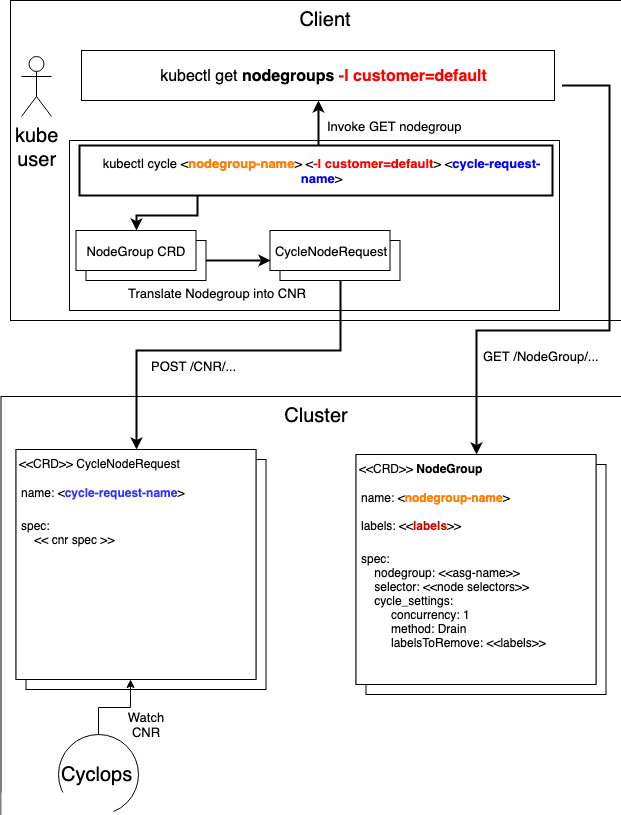
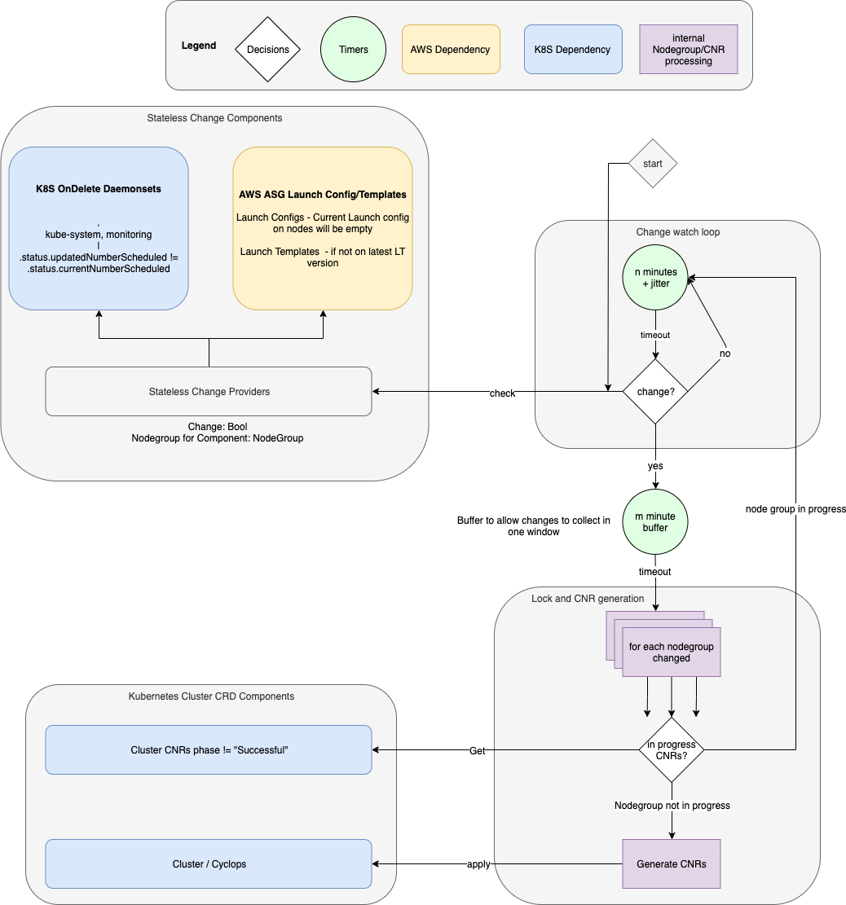

# Automation

## Nodegroup CRD

The Nodegroup CRD is a CRD that acts are a template for a CNR. It describes a group of nodes and how to cycle them. Both the CLI kubectl cycle plugin and the Cyclops automated Observer use them to generate CNRs which Cyclops works on as normal. These Nodegroup CRDs are helpful when you have many different nodegroups across complicated boundaries. 

### Installing CRD

Install the NodeGroup CRD in the cluster.

`kubectl apply -f deploy/crds/atlassian_v1_nodegroup_crd.yaml`

### Create NodeGroups

The nodegroups you create will act as a template for Cyclops tools to rotate nodes without needing to directly interact with the CRDs

The Nodegroup CRD is very similar to the CycleNodeRequest CRD, but acts as a generation template. Here's an example NodeGroup CRD definition.

```yaml
apiVersion: atlassian.com/v1
kind: NodeGroup
metadata:
  name: system
  labels: 
    type: system
    network: private
spec:
  nodeGroupName: "system.example.com"
  nodeSelector:
    matchLabels:
      role: system
      customer: example
      network: private
  cycleSettings:
    method: Drain
    concurrency: 1
  validationOptions:
    skipMissingNamedNodes: true
  healthChecks:
  - endpoint: http://{{ .NodeIP }}:8080/ready
    regexMatch: Ready
    validStatusCodes:
    - 200
    waitPeriod: 5m
```

The cycleSettings dictionary is exactly the same as CycleNodeRequest

`kubectl apply` that nodegroup spec to allow the CLI and observer tools to use it as a template for generating full CNRs

### Listing NodeGroups

`kubectl get nodegroups`

```
NAME                      NODE GROUP NAME          METHOD   CONCURRENCY
system                    system.example.com       Drain    1
```

## CLI

### Installing CLI

Cyclops can use a `kubectl` plugin to cycle with `NodeGroup` CRDs. 

To install the CLI (to your `$GOPATH`) run `make install-cli`

### Using CLI<a name="cli"></a>

Use `kubectl plugin list` to verify that `kubectl-cycle` is recognised by `kubectl`
Example:
```
The following compatible plugins are available:

~/go/bin/kubectl-cycle
```
 
Run `kubectl cycle --help` for examples and usage, the arguments are similar to `kubectl`

```
Usage:
  kubectl-cycle --name "cnr-name" <nodegroup names> or [flags]

Flags:
      --all                            option to allow cycling of all nodegroups
      --allow-missing-template-keys    If true, ignore any errors in templates when a field or map key is missing in the template. Only applies to golang and jsonpath output formats. (default true)
      --as string                      Username to impersonate for the operation
      --as-group stringArray           Group to impersonate for the operation, this flag can be repeated to specify multiple groups.
      --cache-dir string               Default cache directory (default "~/.kube/cache")
      --certificate-authority string   Path to a cert file for the certificate authority
      --client-certificate string      Path to a client certificate file for TLS
      --client-key string              Path to a client key file for TLS
      --cluster string                 The name of the kubeconfig cluster to use
      --concurrency int                option to override concurrency of all CNRs. Set for 0 to skip. -1 or not specified will use values from NodeGroup definition (default -1)
      --context string                 The name of the kubeconfig context to use
      --cycling-timeout string         option to set timeout for cycling. Default to controller defined timeout
      --dry                            option to enable dry mode for applying CNRs
  -f, --filename strings               identifying the resource.
  -h, --help                           help for kubectl-cycle
      --insecure-skip-tls-verify       If true, the server's certificate will not be checked for validity. This will make your HTTPS connections insecure
      --kubeconfig string              Path to the kubeconfig file to use for CLI requests.
      --name string                    option to specify name prefix of generated CNRs
  -n, --namespace string               If present, the namespace scope for this CLI request
      --nodes strings                  option to specify which nodes of the nodegroup to cycle. Leave empty for all
  -o, --output string                  Output format. One of: json|yaml|name|go-template|go-template-file|template|templatefile|jsonpath|jsonpath-as-json|jsonpath-file.
  -R, --recursive                      Process the directory used in -f, --filename recursively. Useful when you want to manage related manifests organized within the same directory. (default true)
      --request-timeout string         The length of time to wait before giving up on a single server request. Non-zero values should contain a corresponding time unit (e.g. 1s, 2m, 3h). A value of zero means don't timeout requests. (default "0")
  -l, --selector string                Selector (label query) to filter on, supports '=', '==', and '!='.(e.g. -l key1=value1,key2=value2)
  -s, --server string                  The address and port of the Kubernetes API server
      --skip-initial-health-checks     option to skip the initial set of health checks before cycling.
      --skip-pre-termination-checks    option to skip pre-termination checks during cycling.
      --template string                Template string or path to template file to use when -o=go-template, -o=go-template-file. The template format is golang templates [http://golang.org/pkg/text/template/#pkg-overview].
      --tls-server-name string         Server name to use for server certificate validation. If it is not provided, the hostname used to contact the server is used
      --token string                   Bearer token for authentication to the API server
      --user string                    The name of the kubeconfig user to use
  -v, --version                        version for kubectl-cycle
```


### Examples

#### cycle system node group
`kubectl cycle --name example-123 system`

#### cycle system and ingress node group
`kubectl cycle --name example-123 system ingress`

#### cycle by labels
`kubectl cycle --name example-123 -l type=default`

#### cycle all nodegroups
`kubectl cycle --name example-123 --all`

#### use kubernetes generated name
`kubectl cycle --all`

#### test cycle all nodegroups with dry mode
`kubectl cycle --name example-123 --all --dry`

#### output CNRs instead of cycling for all nodegroups
`kubectl cycle --name example-123 --all -o yaml`

#### cycle system node group without the initial health checks
`kubectl cycle --name example-123 system --skip-initial-health-checks`

### Example output

Rotating all nodegroups with the CNR prefix "example"

```
❯ kubectl cycle --all --name "example"
fetching nodegroups...
generating + validating CNRs
«─»
all nodegroups valid!
«─»
[applying] example-default-customer-us-west-2a OK
[applying] example-default-customer-us-west-2b OK
[applying] example-default-customer-us-west-2c OK
[applying] example-default-internal-us-west-2a OK
[applying] example-default-internal-us-west-2b OK
[applying] example-default-internal-us-west-2c OK
[applying] example-ingress OK
[applying] example-system OK
«─»
DONE! Applied 8 CNRs successfully
«─»
kubectl -n kube-system get cnr -l name=example to see applied CNRs
```

Example CNRs created with matching label based on name

```
❯ kubectl -n kube-system get cnr -l name=example
NAME                                  NODE GROUP NAME                         METHOD   CONCURRENCY   STATUS      AGE
example-default-customer-us-west-2a   default-customer-1.example-domain.com   Drain    3             ScalingUp   10s
example-default-customer-us-west-2b   default-customer-0.example-domain.com   Drain    3             ScalingUp   10s
example-default-customer-us-west-2c   default-customer-2.example-domain.com   Drain    3             ScalingUp   10s
example-default-internal-us-west-2a   default-internal-1.example-domain.com   Drain    3             ScalingUp   9s
example-default-internal-us-west-2b   default-internal-0.example-domain.com   Drain    3             ScalingUp   9s
example-default-internal-us-west-2c   default-internal-2.example-domain.com   Drain    3             ScalingUp   9s
example-ingress                       ingress.example-domain.com              Drain    1             ScalingUp   9s
example-system                        system.example-domain.com               Drain    1             ScalingUp   9s
```

### Diagram



## Observer<a name="observer"></a>

The Observer works by checking if a cloud provider's node configurations are out of date from the latest configurations, and if any `updateStrategy: OnDelete` daemonsets aren't on the latest revision. It will then use the NodeGroups in the cluster to generate CNRs for rotating only the out of date nodes. The reason for termiantion will be annotated on the CNR. The observer runs on a configurable timed loop for checking for outdated components. Once deployed and configured, there is nothing to do for automatically cycling nodes. CNRs will still go into the `Failed` state, which can be alerted on for manual intervention / investigation. 

### Deploying Operator

For an example Kubernetes deployment spec see [here](../deployment/cyclops-observer.yaml).

For possible configurtation arguments, see `--help`
```
Detects changes on nodegroups for both cloud instances out of date with ASGs and OnDelete pods of DaemonSets. Will create CNRs to automatically cycle affected nodes

Usage:
  cyclops-observer [flags]

Flags:
      --add_dir_header                        If true, adds the file directory to the header
      --addr string                           Address to listen on for /metrics (default ":8080")
      --alsologtostderr                       log to standard error as well as files
      --check-interval duration               duration interval to check for changes. e.g. run the loop every 5 minutes" (default 5m0s)
      --cloud-provider string                 Which cloud provider to use, options: [aws] (default "aws")
      --dry                                   api-server drymode for applying CNRs
  -h, --help                                  help for cyclops-observer
      --log_backtrace_at traceLocation        when logging hits line file:N, emit a stack trace (default :0)
      --log_dir string                        If non-empty, write log files in this directory
      --log_file string                       If non-empty, use this log file
      --log_file_max_size uint                Defines the maximum size a log file can grow to. Unit is megabytes. If the value is 0, the maximum file size is unlimited. (default 1800)
      --logtostderr                           log to standard error instead of files (default true)
      --namespace string                      Namespaces to watch and create cnrs (default "kube-system")
      --namespaces strings                    Namespaces to watch for cycle request objects (default [kube-system])
      --node-startup-time duration            duration to wait after a cluster-autoscaler scaleUp event is detected (default 2m0s)
      --now                                   makes the check loop run straight away on program start rather than wait for the check interval to elapse
      --once                                  run the check loop once then exit. also works with --now
      --prometheus-address string             Prometheus service address used to query cluster-autoscaler metrics (default "prometheus")
      --prometheus-scrape-interval duration   Prometheus scrape interval used to detect change of value from prometheus query, needed to detect scaleUp event (default 40s)
      --skip_headers                          If true, avoid header prefixes in the log messages
      --skip_log_headers                      If true, avoid headers when opening log files
      --stderrthreshold severity              logs at or above this threshold go to stderr
  -v, --v Level                               number for the log level verbosity (default 0)
      --vmodule moduleSpec                    comma-separated list of pattern=N settings for file-filtered logging
      --wait-interval duration                duration to wait after detecting changes before creating CNR objects. The window for letting changes on nodegroups settle before starting rotation (default 2m0s)
```

### Diagram


