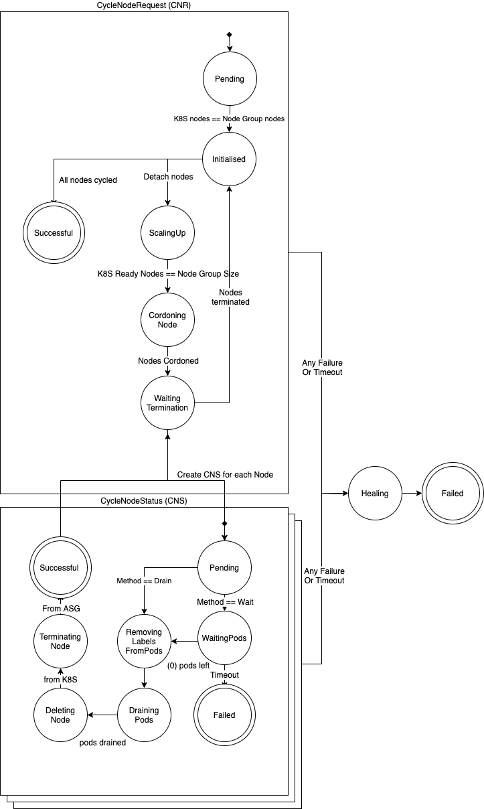

# Cycling Documentation 

For more concrete examples see [examples](./examples/README.md)

- [Cycling Documentation](#cycling-documentation)
  - [Cycle Process<a name="cycling"></a>](#cycle-process)
    - [CycleNodeRequest](#cyclenoderequest)
    - [CycleNodeStatus](#cyclenodestatus)
  - [State Machine Diagram](#state-machine-diagram)
  - [CycleNodeRequest object](#cyclenoderequest-object)
  - [Usage <a name="cycling"></a>](#usage-)
    - [Interacting with the CRDs](#interacting-with-the-crds)
      - [Creating](#creating)
      - [GET](#get)
      - [Describing](#describing)

## Cycle Process<a name="cycling"></a>

Below is the process that the operator will follow when cycling a group of nodes:

The Cyclops cycle process works as a state machine, transitioning to different states once certain criteria is satisfied for the current state. For the purpose of this document with will call these states *phase*.

### CycleNodeRequest

The CycleNodeRequest CRD handles a request to cycle nodes belonging to a specific node group.

1. Watch for new, **undefined** CycleNodeRequest objects in the namespace that Cyclops is running in.

2. Validate the CycleNodeRequest object's parameters, and if valid, transition the object to **Pending**.

3. In the **Pending** phase, store the nodes that will need to be cycled so we can keep track of them. Describe the node group in the cloud provider and check it to ensure it matches the nodes in Kubernetes. It will wait for a brief period and proactively clean up any orphaned node objects, re-attach any instances that have been detached from the cloud provider node group, and then wait for the nodes to match in case the cluster has just scaled up or down. Transition the object to **Initialised**.

4. In the **Initialised** phase, detach a number of nodes (governed by the concurrency of the CycleNodeRequest) from the node group. This will trigger the cloud provider to add replacement nodes for each. Transition the object to **ScalingUp**. If there are no more nodes to cycle then transition to **Successful**.

5. In the **ScalingUp** phase, wait for the cloud provider to bring up the new nodes and then wait for the new nodes to be **Ready** in the Kubernetes API. Wait for the configured health checks on the node succeed. Transition the object to **CordoningNode**.

6. In the **CordoningNode** phase, cordon the selected nodes in the Kubernetes API then perform the pre-termination checks. Transition the object to **WaitingTermination**.
    
7. In the **WaitingTermination** phase, create a CycleNodeStatus CRD for every node that was cordoned. Each of these CycleNodeStatuses handles the termination of an individual node. The controller will wait for a number of them to enter the **Successful** or **Failed** phase before moving on.
    
    If any of them have **Failed** then the CycleNodeRequest will move to **Failed** and will not add any more nodes for cycling. If they are all **Successful** then the CycleNodeRequest will move back to **Initialised** to cycle more nodes.
    
### CycleNodeStatus

The CycleNodeStatus CRD handles the draining of pods from, and termination of, an individual node. These should only be created by the controller.

1. Watch for new, **undefined** CycleNodeStatus objects in the namespace that Cyclops is running in.

1. Validate the CycleNodeStatus object's parameters, and if valid, transition the object to **Pending**.

1. In the **Pending** phase, validate that the node still exists and store information about the node.
    Transition the object to **WaitingPods** if the Method is set to "Wait", otherwise transition to 
    **RemovingLabelsFromPods**.
    
1. In the **WaitingPods** phase, wait for all pods that are not ignored by the `waitRules` to be removed from the node. Will wait for a long time before finally giving up if pods still remain. Transition the object to **Failed** if it times out waiting, or to **RemovingLabelsFromPods** once there are no pods left. 

1. In the **RemovingLabelsFromPods** phase, remove any labels that are defined in the `labelsToRemove` option from any pod that is running on the target node. This is useful when you want to "detach" a pod from a service before draining it from a node to prevent requests in progress to the pod from being interrupted. Transition the object to **DrainingPods**.

1. In the **DrainingPods** phase, drain (evict or delete) the pods from the target nodes. Draining of nodes works how `kubectl` drain nodes does. Transition the object to **DeletingNode**.

1. In the **DeletingNode** phase, delete the node out of the Kubernetes API. Transition the object to **TerminatingNode**.

1. In the **TerminateNode** phase, request the node to be terminated from the cloud provider.
    Once the instance has been requested for termination, transition to **Successful**.

## State Machine Diagram



## CycleNodeRequest object

Example yaml that explains all possible fields in the CycleNodeRequest spec. For more concrete examples please see [examples](./examples/README.md)

```yaml
apiVersion: "atlassian.com/v1"
kind: "CycleNodeRequest"
metadata:
  name: "example"
  labels:
    name: "example"
spec:
  # NodeGroupName is the name of the node group in the cloud provider.
  nodeGroupName: "<fully_qualified_node_group_name>"

  # Optional field - nodeGroupsList is a list of cloud provider node groups which have those instances
  # select by the label selector described below
  # use case for this would be a group of nodes with same label selector are managed by multiple cloud
  # provider node groups, like split by availability zone for autoscaling purpose and you also want to 
  # control the concurrency of the cycling between these node groups as those nodes are basically same 
  # type of nodes inside the cluster. To make it work, you need to specify all those cloud provider node
  # groups in this list. It can work with `nodeGroupName` and automatically de-duplicate node groups 
  # specified inside `nodeGroupName` and `nodeGroupsList`.
  nodeGroupsList:
    - nodeGroupA
    - nodeGroupB
    - nodeGroupC

  # Selector is a Kubernetes style selector. Used to select the nodes in the node group.
  selector:
    matchLabels:
      labelKeyA: valueA
      labelKeyB: valueB

  # Optional field - use this to cycle specific node names out of the group, ignoring other nodes that are in the group. List
  nodeNames:
    - "node-name-A"
    - "node-name-B"

  # Optional section - collection of validation options to define stricter or more lenient validation during cycling.
  validationOptions:
    # Optional field - Skip node names defined in the CNR that do not match any existing nodes in the Kubernetes API.
    skipMissingNamedNodes: true|false

  cycleNodeSettings:
      # Method can be "Wait" or "Drain", defaults to "Drain" if not provided
      # "Wait" will wait for pods on the node to complete, while "Drain" will forcefully drain them off the node
      method: "Wait|Drain"

      # Optional field - use this to scale up by `concurrency` nodes at a time. The default is the current number
      # of nodes in the node group
      concurrency: 5

      # Optional field - use this to set how long the controller will tries to process a CNS for before
      # timing out. The default is defined by the controller
      cyclingTimeout: 10h2m1s

      # Optional field - use this to remove a list of labels from pods before draining. Useful
      # if you want to remove them from existing services before draining the nodes
      labelsToRemove:
        - <labelKey>
    
      # Optional field - only used if method=Wait
      # ignorePodsLabels is a map of label names to a list of label values, where any value for the given
      # label name will cause a pod to not be waited for
      ignorePodsLabels:
        # This example ignores all pods where labelName=value1 or labelName=value2
        labelName:
        - "value1"
        - "value2"
  
      # Optional field - only used if method=Wait
      # ignoreNamespaces is a list of namespaces from which to ignore pods when waiting for pods on a node to finish
      ignoreNamespaces:
      - "kube-system"
```

## Usage <a name="cycling"></a>

### Interacting with the CRDs

The Cyclops CRDs can be used in the same manner as any other CRD or Kubernetes resource (create, get, delete, describe, etc).

#### Creating


```bash
kubectl apply -f my-cnr.yaml
```

This will apply the CNR `my-cnr` to the cluster.

#### GET

```bash
# get the CycleNodeRequests in the cluster
# this will show the current STATUS of the CNR in the table
kubectl get cnr
``` 

Example output
```bash
NAME    NODE GROUP NAME                              NODE SELECTOR                                   METHOD   CONCURRENCY   STATUS      AGE
my-cnr  example.my-nodes.my-site.com                 map[matchLabels:map[role:node]]                 Drain    1             ScalingUp   4m
```

#### Describing

```bash
# describe the CycleNodeRequest "my-cnr" to view detailed information about the progress of the request
kubectl describe cnr my-cnr
``` 

Example output
```
Name:         my-cnr
Namespace:    kube-system
API Version:  atlassian.com/v1
Kind:         CycleNodeRequest
Metadata:
  Creation Timestamp:  2019-08-29T01:54:31Z
  Generation:          9
  Resource Version:    7019110
  Self Link:           /apis/atlassian.com/v1/namespaces/kube-system/cyclenoderequests/test
  UID:                 f13c7d57-c9ff-11e9-9ea4-06545c742470
Spec:
  Cycle Settings:
    Concurrency:    1
    Method:         Drain
  Node Group Name:  example.my-nodes.my-site.com
  Selector:
    Match Labels:
      Role:      node
Status:
  Current Nodes:
    Name:         ip-10-149-72-60.us-west-2.compute.internal
    Provider Id:  aws:///us-west-2b/i-0119f6aa6b63ce0ce
  Message:        
  Nodes To Terminate:
    Name:            ip-10-149-72-94.us-west-2.compute.internal
    Provider Id:     aws:///us-west-2c/i-0f4c087f7a7e9a20c
    Name:            ip-10-149-72-60.us-west-2.compute.internal
    Provider Id:     aws:///us-west-2b/i-0119f6aa6b63ce0ce
    Name:            ip-10-149-72-26.us-west-2.compute.internal
    Provider Id:     aws:///us-west-2a/i-0e50c5b04787f3c2d
  Phase:             ScalingUp
  Scale Up Started:  2019-08-29T01:58:06Z
Events:
...
```

CycleNodeRequests can be deleted, however the recommended process is to keep Successful requests in the cluster, and create CNRs with unique names in order to identify and track cycling of nodes in a DevOps manner.
